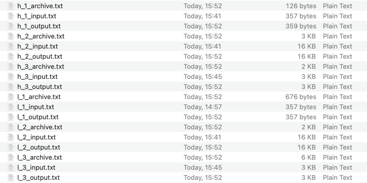
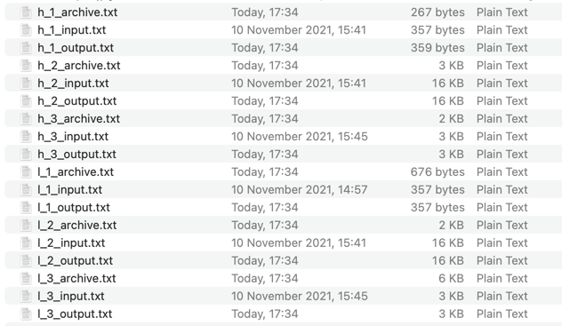

<h1>Архивариус</h1>
<h6>Что это?</h6>
Мультиплатформенное десктопное приложение на фреймворке Avalonia для архивирования различных типов файлов.
<h6>Что умеет?</h6>
Данный проект позволяет архивировать/разархивировать/добавлять в архив различные тексты с помощью алгоритмов кодирования информации:
- Алгоритм Хаффмана
- Алгоритм LZW (Лемпела-Зива-Велча)
<h6>Особенности</h6>
<ul>
<li>Приложение умеет работать в двух режимах работы: консоль и окно</li>
- Консольное приложение поддерживает ввод команд: create, add, decompress, help, version 
- Оконный режим предусматривает работу с теми же функциями, но в виде понятному пользователю интерфейса
<li>Приложение можно открывать в различных операционных системах: Windows, Mac, Linux</li>
<li>Файлы сохраняются с расширением, обозначающим используемый алгоритм: ".huf" - для Хаффмана, ".lzw" - для ЛЗВ</li>
<li>Файлы разархивируются с приставкой "d_", что означает "decompressed", для того, чтобы можно было легко отличить их от оригинала</li>
</ul>
<h6>Перспективы</h6>
- Благодаря гибкой архитектуре можно быстро внедрять новые алгоритмы сжатия
- Добавление новых функций не нарушит уже существую архитектуру. Например, извлечение определенных файлов из архива
<h6>Выводы по разработке</h6>
В ходе разработки данных алгоритмов было обнаружено, что данные алгоритмы более эффективны на больших объемах данных.
Также мы выяснили, что код Хаффмена имеют один существенный недостаток по сравнению с кодом LZW - он никак не учитывает взаимосвязей между символами, которые присутствуют практически в любом тексте. 
С другой стороны если в тексте нет взаимосвязи между символами LZW будет неэффективен в таком случае. 
Еще пара слов об LZW: он может работать только с теми файлами, которые содержат только ASCII символы из основной таблицы. Позже было выяснено, что для сжатия изображений требуется словарь из little endian ASCII символов. Это приводит к мысли о том, что словарь должен подстраиваться под определенные типы данных.

Ниже представлена статистика по работе с различными данными* ("h_"-файлы сжатые Хаффманом, "l_"-файлы сжатые LZW):

- *с учетом того, что дерево Хаффмана в файл не добавляется

Ниже представлена статистика по работе с различными данными, где дерево Хаффмана добавлено:

